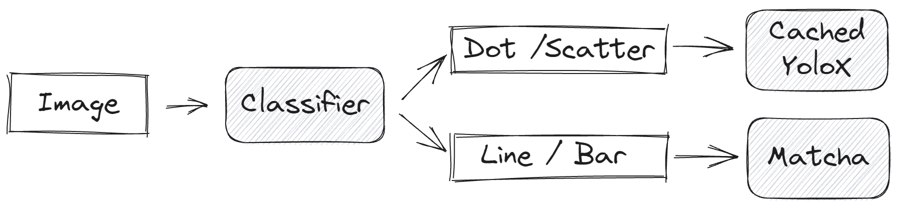
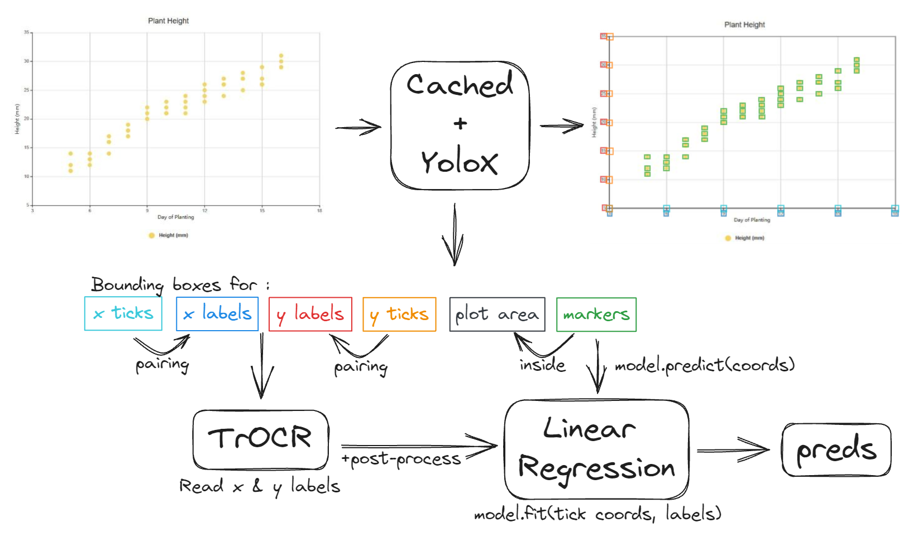
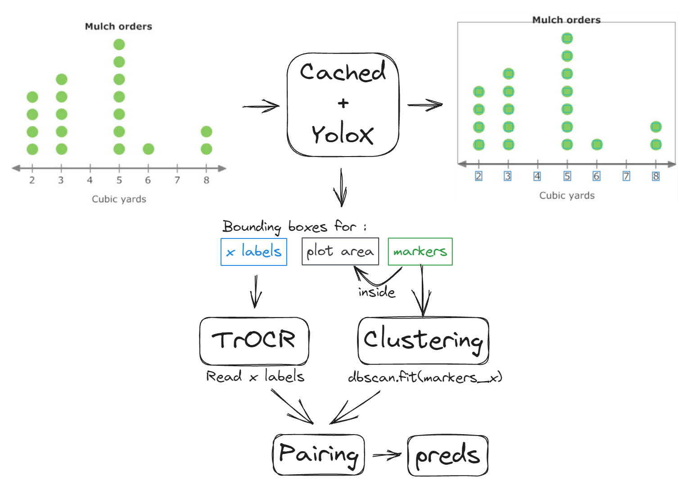

# 3rd Place Solution to the Benetech - Making Graphs Accessible Competition

**Authors :** [Theo Viel](https://github.com/TheoViel), [Andrija Milicevic](https://github.com/CroDoc)

## Introduction - Adapted from [TODO](link)

Our solution is a 2 step pipeline, where the first step is a simple classification task and the 2nd step solves the task for the different chart types. For scatter and dot plots, we used a detection approach. For line and bar charts, Matcha was really strong. This repository contains the code for the classification, dot and scatter parts.



### Scatter



For scatter, we relied on [YoloX](https://github.com/Megvii-BaseDetection/YOLOX) to detect all markers. Cached is used to take care of the other useful elements. If all the points are detected correctly, it’s not that complicated to infer the target : detect the ticks & labels, read the labels, and interpolate !


### Dots



Dot pipeline is similar to scatter, but a bit more simple. We detect the points and cluster them, and map them to the detected x-labels. Labels with no assigned cluster are given the target 0, others the number of detected points. Counting points is not really robust to detection mistakes, so instead we used the height of the uppermost point and interpolate.

## How to use the repository

### Prerequisites

- Clone the repository

- Download the data in the `input` folder:
  - [Competition data](https://www.kaggle.com/competitions/benetech-making-graphs-accessible/data)
  - [Other data we generated](https://www.kaggle.com/datasets/theoviel/benetech-input-data)

- Setup the environment :
  - `bash setup.sh`

We also provide trained model weights :
  - [Classification](https://www.kaggle.com/datasets/theoviel/benetech-weights)
  - [YoloX](https://www.kaggle.com/datasets/theoviel/benetech-yolox-weights)


### Run The pipeline

#### Classification

- `bash train_cls.sh` will train the two classification models

#### YoloX

- `bash train_yolox.sh` will train the two detection models
It relies on the original YoloX repository.


#### Dot & Scatter

Dot and scatter pipelines are available in the `notebooks/` folder. Make sure to replace the weights with the correct paths depending on your setup.

#### Evaluation & inference

Evaluate your models using `Validation.ipynb`. The second part of the notebook runs the inference on the validation data, and is used to evaluate distilled models with (or without) model soup. Conversion of the models to tflite is done using `Inference_Ens.ipynb`. 


## Code structure

If you wish to dive into the code, the repository naming should be straight-forward. Each function is documented.
The structure is the following :

```
src
├── data
│   ├── dataset.py              # Dataset class
│   ├── loader.py               # Dataloader
│   ├── preparation.py          # Data preparation
│   └── transforms.py           # Augmentations
├── inference           
│   ├── cls.py                  # Classification inference file
│   ├── utils.py                # Detection inference utils
│   └── yolox.py                # YoloX inference function
├── model_zoo 
│   ├── gem.py                  # GeM pooling
│   └── models.py               # Classification model
├── post_process                        
│   ├── dots.py                 # Post processing for dots
│   ├── in_graph.py             # FP removal using CACHED chart bbox
│   ├── outliers.py             # Handles ticks & ocr outliers
│   ├── reg.py                  # Linear regression to infer scatter values
│   ├── retrieve.py             # Visual similarity to retrieve FNs
│   ├── tick_point.py           # FP removal using CACHED tick predictions
│   └── ticks.py                # Tick-label pairing
├── util
│   ├── boxes.py                # Bounding boxes handling
│   ├── logger.py               # Logging utils
│   ├── metrics.py              # Metrics for the competition
│   ├── ocr.py                  # TrOCR
│   ├── plots.py                # Plotting utils
│   └── torch.py                # Torch utils
├── main.py                     # Classification Training script
└── params.py                   # Main parameters
``` 

The cleaning branch contains enough information to run our pipeline, but skips a lot of data preparation steps. If you wish to get your hands dirty and dig into data processing, switch to the master branch and refer to the `notebooks/` folder.